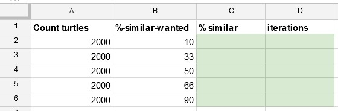

# Does spatial segregation of ethnic groups in cities imply intolerant individuals?

We will explore how we might use agent-based modelling to think about this question, following in the footsteps of [Thomas Schelling](https://en.wikipedia.org/wiki/Thomas_Schelling#Models_of_segregation).

## Defining 'Happiness'
Let's think about a hypothetical city neighbourhood with households on a grid. How might we define 'happiness' of a household with reference to the similarity of its neighbours (i.e. its spatial context).

### Step 1
**Download** [this model code](HappyUnhappy_v6.nlogo) - on Windows, right-click and choose 'Save Link As' (or similar); on Mac Control-click and choose 'Download Linked File'.

### Step 2
**Open the model you have just downloaded.** You can do this in one of two ways:
- if you have NetLogo installed on your computer (as on King's College computers) open NetLogo then go to File -> Open and find the _HappyUnhappy_v6.nlogo_ file on your computer (likely in the downloads folder)</li>
- if you do not have NetLogo installed on your computer (likely, if you are on your own computer and have never used NetLogo before), go to [NetLogo Web](https://netlogoweb.org/), click the _Browse_ button in top right to Upload a Model, and find the _HappyUnhappy_v6.nlogo_ file on your computer (likely in the downloads folder)

### Step 3
**Read** the contents of the Model Info tab:
- In the NetLogo program the Info tab is at the top.
- In NetLogo Web the Model Info tab is at the bottom.

Make sure you understand how 'happiness' is defined, by reading the contents of the Model Info tab fully and experimenting the model by clicking the buttons, moving the slider and observing the output (in the Interface tab in the NetLogo program, which should look something like the image below). Remember to click the _Setup_ button each time you want to restart.

### Step 4
To see how happiness is actually calculated by the model, **go to the Code tab** and find the `answer` procedure (all the code between `to answer` and `end`).

## The Schelling Model
Now that we understand how happiness is defined in this model, let's consider how we might make the model dynamic by allowing households to move location if they are 'unhappy'. Households move until they find a location where they are 'happy'. If all households can find a location at which they are happy, the simulation stops and we can assess segregation.

### Step 5
**Download** [this model code](Segregation_shapes_v6.nlogo) and open in NetLogo or NetLogo Web (as in Steps 1 and 2)

### Step 6
**Read** the 'What is it?' and 'How to use it' sections in the Info tab (as in Step 3).

### Step 7
**Open the Code tab.** You will see that we have more code in this model than the first. Look at how the `setup` procedure is similar (but slightly different) to the `setup` procedure in the first model.

### Step 8
**Explore the model.** Click the _Setup_ button each time you want to reset the model to a new random initial state. Note how the _Go_ button has two arrows pointing to one another in the bottom left while the _Go Once_ button does not (in the Interface tab in the NetLogo program, which should look something like the image above). The arrows mean that all code in the procedure called by the button will be continuously repeated until the code tells it to stop.

#### Step 8a
The _Go_ and _Go Once_ buttons call the `go` procedure, which is the dynamic part of the model code - **find the `go` procedure in the code**. The difference is that the _Go Once_ button ask the computer to execute the `go` procedure once, while the _Go_ button repeatedly asks.

The `go` procedure calls the `update-happiness` procedure - note how this is similar to the `answer` procedure in the first model.

#### Step 8b
Next in the `go` procedure, there's a check to see if all turtles are happy - if so, the model stops, otherwise the `move-unhappy-turtles` procedure is called. **Find the `move-unhappy-turtles` procedure** and check you understand what it does.

After the `move-unhappy-turtles` procedure, the timestep is increased by 1 (not relevant for the model, but needed to ensure the plots are produced properly). Each time the `go` procedure is repeated is known as _an iteration_.

## Model Experimentation

### Step 9
**Experiment with the model.** Work through the instructions in the 'Things to Try' section of the Info tab. Record your results in a spreadsheet (e.g. Excel). Setup your results table as shown in the image below - your results will be typed into the shaded (green) cells.

### Step 10
**Answer the following questions:**
1. For 2000 households but different values for `%-SIMILAR-WANTED`, how does the overall degree of segregation change?
2. If each household wants at least 10% `same-shape` neighbours, what percentage (on average) do they end up with? What does this imply about drivers of segregation?
3. For different values of `%-SIMILAR-WANTED`, how many iterations does it take before everyone is happy?
4. Does the number of households in the space influence the patterns you found above? (e.g. repeat the experiment above of different `%-SIMILAR-WANTED` values but for a different number of households)

## Online Resources
- [NetLogo Homepage](http://ccl.northwestern.edu/netlogo/)
- [NetLogo Modelling Commons](http://modelingcommons.org)

## Further Reading
- Grimm, V. and Railsback S.F. (2012) _Agent and Individual Based Modelling: A Practical Introduction._ Princeton NJ: Princeton University Press
- O'Sullivan, D. and Perry, G.L.W. (2013) _Spatial Simulation: Exploring Pattern and Process._ Chichester, U.K.: Wiley-Blackwell.

#### Licence
This material is licenced by [James D.A. Millington](https://www.landscapemodelling.net)</a> under a [Creative Commons Attribution-NonCommercial-ShareAlike 4.0 International](http://creativecommons.org/licenses/by-nc-sa/4.0/) licence.
